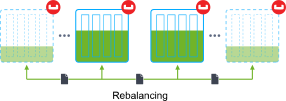
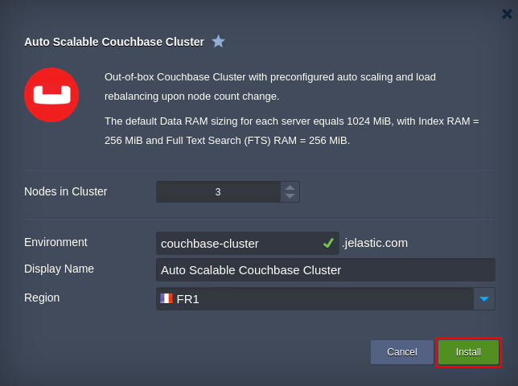
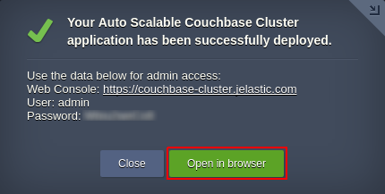

# Couchbase Cluster in Docker Containers 

Prepackaged clustered NoSQL Couchbase DB solution with out-of-box automatic scaling and embedded data rebalancing for one-click
deployment into Docker containers.

## Couchbase Cluster Topology

The current package implements instant deployment of a preconfigured Couchbase Cluster within Jelastic Cloud. Being run in
Docker containers, it’s built on top of the official [*couchbase*](https://hub.docker.com/_/couchbase/) template. By default,
you get 3 interconnected Couchbase containers (though their number could be adjusted beforehand, during the package
installation stage). 

Upon creation, each Couchbase container is assigned *16 dynamic cloudlets* as a room of resources for [vertical scaling](https://docs.jelastic.com/automatic-vertical-scaling) (up to 2
GiB of RAM and 6.4 GHz of CPU). Subsequently, this default limit could be adjusted through the environment topology wizard by
following the linked guide.

Also, the following values are set as a maximal memory allocation size for the corresponding RAM services at each node in the
cluster:
- *Data* RAM - 1024 MiB
- *Index* RAM - 256 MiB
- *Full Text Search* (FTS) RAM - 256 MiB

And to ensure sufficient level of security, connection to a cluster is established over the *HTTPS* protocol with [Jelastic SSL](https://docs.jelastic.com/jelastic-ssl) certificate being attached by default.  

## Auto-Scaling Configuration

The Couchbase cluster size is automatically adjusted based on incoming load by changing the DB servers number (up to 10
instances per layer) according to the following conditions:
- *+1 node* if CPU/RAM usage is *>70%* for at least *5 minutes*
- *-1 node* if CPU/RAM usage is *<40%* for at least *5 minutes*

When a node is added to or removed from the cluster, the process of *data rebalancing* is automatically handled. It is aimed
to evenly re-distribute all the information, stored within a cluster, across the available nodes. Herewith, the cluster
remains up and continues to serve and handle client requests. 

Herewith, each executed auto-scaling operation is supplemented with an appropriate email notification. In case you’d like to
change the conditions of automatic scaling manually, adjust the appropriate triggers by following the [Automatic Horizontal
Scaling](https://docs.jelastic.com/automatic-horizontal-scaling) guide.

## How to Install Auto-Scalable Couchbase Cluster

In order to get Couchbase Cluster automatically set up, click the **Deploy to Jelastic** button below and specify your email
address within the opened widget. Then, choose one of the [Jelastic Public Cloud](https://jelastic.cloud/) providers (in case
you don’t have an account at the chosen platform, it will be created automatically) and click **Install**.

Otherwise, i.e. to deploy the package manually, log in to Jelastic dashboard with your credentials and [import](https://docs.jelastic.com/environment-import) link to the **_manifest.jps_** file above.

Within the installation window, set a number of *Nodes in Cluster* to be created, type *Environment* name, and optional
*Display Name* ([environment alias](https://docs.jelastic.com/environment-aliases)). Also, select the preferable [region](https://docs.jelastic.com/environment-regions) (if several ones are available) and click **Install**.

Wait a few minutes for Jelastic to prepare your environment and configure the auto-scaling settings. Once cluster is up,
you’ll be shown the appropriate pop-up message.

Click **Open in browser** here to access the *Couchbase Web Console* with your credentials and start exploring the available
features and filling up your DB with the data. 

For more information on the Couchbase Cluster performance, refer to the following [article](http://blog.jelastic.com/2017/07/20/auto-scalable-couchbase-cluster-in-docker-containers/).
